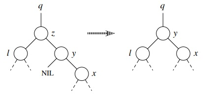
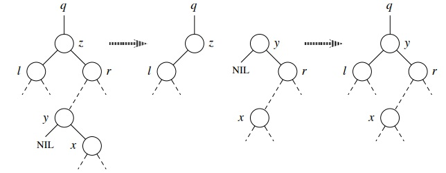

# README : Projet SDA #

## Membre du gourpe ##

| Nom Prénom      | Numéro Etudiant | Pseudonyme |
| :-------------  | :-------------- | :--------- |
| Bayard Emeric   | 11606611        | Dryska     |
| Sheikh Rakib    | 11502605        | NoobZik    |
| Yesli  Rayane   | 11507199        | soso7      |
| Belmaati Yacine | 11513398        | Laser1W    |

### Current version : Git init ###

demander ce que fait comparaison et keepit

### Information de la part de l'Institut Montefiore de Liège (Belgique) ###

*   How do I handle duplicate keys?
The BST should be able to hold several times the same keys for this project. The BinarySearchTree.h header has been adapted in that regard.

*   In the intersect function, can I assume that the list are sorted?
The lists should indeed be sorted, but not according to the same field. Overall, this is as if they weren't sorted.

*   In the intersect and getInRange functions, what should be returned in case of emptiness?
They should return a list of size 0. The header files and the submission platform have been updated accordingly.

___

*   **Insert In BST is now fixed**
*   **getInRange is now fixed**
La complexité de la fonction getInRange est de O(n) n représente le nombre de nodes dans l'arbre binaire.

*   ***freeBST for false statement is broken (not freeing)***

### FreeBST par Rakib ###

Donc en faite, on passe un paramètre un noeud qu'on veut supprimer + un booléen
si on veut supprimer son contenue, c'est-à-dire fils gauche et fils droit.

La fonction est divisé en deux bloc, on commence par le plus compliqué.

#### Cas où freeContent est ***false*** ####
Attention, il ne fait pas de free, je l'ai remarqué en testant le prog.

Il y a 3 cas distincs
1.   Il y a les deux fils.
2.   Il y a un fils droit uniquement.
3.   Il y a un fils gauche uniquement.

##### 1er Cas : Il y a les deux fils. #####

```c
if (bst->left != NULL && bst->right != NULL)
```

Ce cas est lui-même divisé en 2 cas.
Considérons le schéma A suivant
*   Cas A :


**NB :** y est dans le sous-arbre de droite et n’a pas de fils gauche.
*   Si y est le fils droit de z, remplacer z par y et conserver le fils droit de y.
```c
if (bst->right->left == NULL) {
  bst->right->left = bst->left;
  bst = bst->right;
}
```
*   Cas B :
Considérons le schéma B suivant :


y est dans le sous-arbre droit de z mais n'en est pas la racine. On remplace y par son propre fils droit et on remplace z par y.
Le code est inspiré de la version itérative du cours de ENSTA dispo sur l'ENT page 77.

J'ai eu besoin d'avoir le successeur du bst, pour ça il fallait retrouver le noeud minimal qui se trouve dans la partie de droite du bst. En conséquence, j'ai du rajouté une fonction *bstMinimum*.

```c
else {
  y = bstMinimum(bst->right);
  tmp = y;
  y = tmp->right;
  tmp->left = bst->left;
  tmp->right = bst->right;
  bst = tmp;
}
```
##### Pour le 2eme et 3eme cas #####


##### 2eme Cas : Il y a le fils droit. #####
```c
if (bst->left == NULL && bst->right != NULL) {
  bst = bst->right;
  return;
}
```

##### 3eme Cas : Il y a le fils gauche. #####
```c
if (bst->left != NULL && bst->right == NULL) {
  bst = bst->left;
  return;
}


```

#### Cas où freeContent est ***true*** ####

Dans ce cas, on fait une récursion pour free ce qui est à gauche et à droite pour ensuite free le bst, donc rien de compliqué.

```c
if (bst != NULL) {
  freeBST(bst->left, false);
  freeBST(bst->right, false);
  free(bst);
}
```
